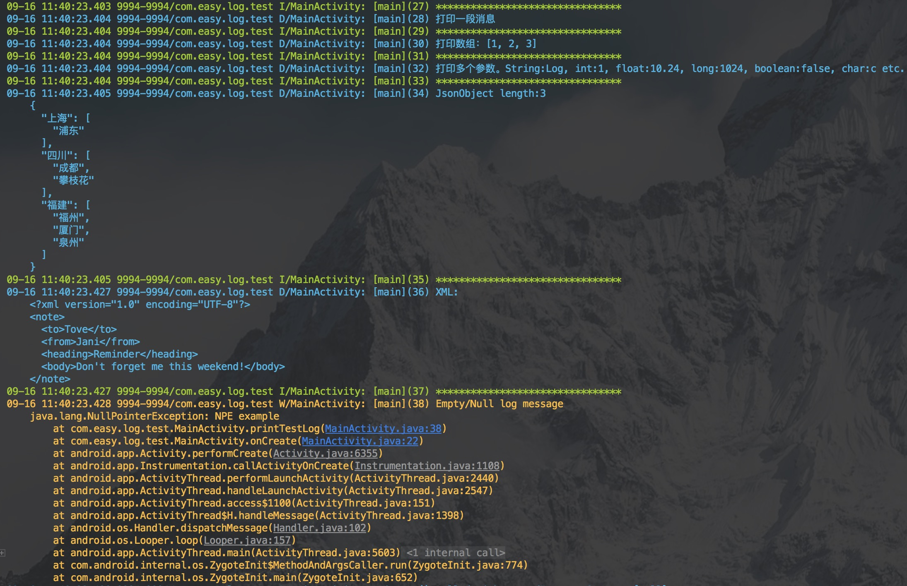

# AndEasyLog
[](https://jitpack.io/#isuperqiang/AndEasyLog)

一款简洁实用的 Android 日志库

**README in [English](README_EN.md)**

### 添加依赖：
第一步：在工程根目录 build.gradle 的 allprojects → repositories 下面添加 JitPack 仓库

```
    allprojects {
        repositories {
            ...
            maven { url 'https://jitpack.io' }
        }
    }
```

第二步：在模块 build.gradle 添加依赖

```
    dependencies {
        implementation 'com.github.isuperqiang:AndEasyLog:1.7.0'
    }
```

### 特点：
1. 支持 5 种日志打印级别：verbose、debug、info、warn、error
2. 支持格式化打印 JSON 和 XML，可以直接打印数组、Intent 和 Bundle
3. 支持打印当前线程名称和日志行号
4. 支持设定日志 Tag，一般使用当前类名作为 Tag
5. 支持打印无限长的日志，没有 4k 字符的限制
6. 支持输出到文件，配置保存目录即可
7. 导入 extra 文件夹下的 live-template-settings.jar，即可使用快捷输入

### 使用：
1. **开关配置**：

> 在 Application 的 onCreate 方法中，配置全局日志的开关。默认开启 Logcat 打印，关闭文件打印。

```java
        /*打开 logcat 日志*/
        /*打开 文件 日志*/
        LoggerFactory.init(new LoggerConfig.Builder()
                .context(this)
                .logcatEnabled(true)
                .logFileEnabled(true)
                .build());
```

2. **初始化**：

> 在每个类里面实例化 ILogger。

`private final ILogger logger = LoggerFactory.getLogger("MainActivity");`

或者

`private final ILogger logger = LoggerFactory.getLogger(MainActivity.class);`

3. **打印日志**：

> 多个参数时，建议使用占位符 {}，避免手动拼接长字符串。

* `logger.debug("打印一段消息");`
* `logger.debug("打印多个参数。String:{}, int:{}, long:{}, boolean:{}, char:{} etc.", "AndroidLog", 100, 1000L, false, 'c');`
* `logger.json("{\"上海\":[\"浦东\"],\"四川\":[\"成都\",\"攀枝花\"],\"福建\":[\"福州\",\"厦门\",\"泉州\"]}");`
* `logger.xml("<?xml version=\"1.0\"?><note><to>Tove</to><from>Jani</from><heading>Reminder</heading><body>Don't forget me this weekend!</body></note>");`
* `logger.warn(new NullPointerException("NPE"));`

  

4. **日志说明**：

>  \[线程名称\](方法行号) 消息内容

5. **混淆规则**：

>  没有限制，随便混淆

## 关于我
* [博客](https://isuperqiang.cn)
* [简书](http://www.jianshu.com/u/d5f18207fa2e)

## 许可
<pre>
Copyright 2017 Richie Liu

Licensed under the Apache License, Version 2.0 (the "License");
you may not use this file except in compliance with the License.
You may obtain a copy of the License at

   http://www.apache.org/licenses/LICENSE-2.0

Unless required by applicable law or agreed to in writing, software
distributed under the License is distributed on an "AS IS" BASIS,
WITHOUT WARRANTIES OR CONDITIONS OF ANY KIND, either express or implied.
See the License for the specifAAic language governing permissions and
limitations under the License.
</pre>
