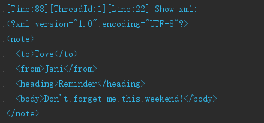
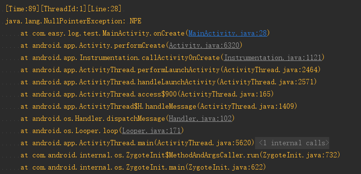

# AndEasyLog
[](https://jitpack.io/#isuperqiang/AndEasyLog)

一个简洁实用的 Android 日志库

### 添加依赖：
第一步：在工程根目录 build.gradle 的 allprojects → repositories 下面添加 JitPack 仓库

```
    allprojects {
        repositories {
            ...
            maven { url 'https://jitpack.io' }
        }
    }
```

第二步：在模块 build.gradle 添加依赖

```
    dependencies {
        compile 'com.github.isuperqiang:AndEasyLog:1.0.2'
    }
```

### 特点：
1. 支持 5 种日志打印级别：verbose、debug、info、warn、error
2. 支持格式化打印 Json 和 Xml
3. 支持打印代码执行时间、线程 ID 和行号
4. 支持指定 Tag，配合 Studio 的 LiveTemplates 使用更酸爽
5. 支持打印无限长的日志，没有 4k 字符的限制

### 使用：
全局日志开关配置，建议在 Application 设置：

`LogConfig.setLogEnable(true);`

在每个类里初始化：

`private final ILogger log = LoggerFactory.getLogger("MainActivity");`

or

`private final ILogger log = LoggerFactory.getLogger(MainActivity.class);`


打印日志：


`log.debug("打印一段消息");`
```
[Time:92][ThreadId:1][Line:30] 打印一段消息
```

`log.debug("打印多个参数。String:{}, int:{}, long:{}, boolean:{}, char:{} etc.", "AndroidLog", 100, 1000L, false, 'c');`

```
[Time:97][ThreadId:1][Line:25] 打印多个参数。String:AndroidLog, int:100, long:1000, boolean:false, char:c etc.
```

`log.json("{\"上海\":[\"浦东\"],\"四川\":[\"成都\",\"攀枝花\"],\"福建\":[\"福州\",\"厦门\",\"泉州\"]}");`


`log.xml("<?xml version=\"1.0\"?><note><to>Tove</to><from>Jani</from><heading>Reminder</heading><body>Don't forget me this weekend!</body></note>");`



`log.warn(new NullPointerException("NPE"));`



消息说明：

Time: 从日志创建起的时间值; ThreadId: 线程 ID; Line: 行号

## 关于我
* [微博](http://weibo.com/u/3013545097)
* [简书](http://www.jianshu.com/u/d5f18207fa2e)

## 许可
<pre>
Copyright 2017 Richie Liu

Licensed under the Apache License, Version 2.0 (the "License");
you may not use this file except in compliance with the License.
You may obtain a copy of the License at

   http://www.apache.org/licenses/LICENSE-2.0

Unless required by applicable law or agreed to in writing, software
distributed under the License is distributed on an "AS IS" BASIS,
WITHOUT WARRANTIES OR CONDITIONS OF ANY KIND, either express or implied.
See the License for the specific language governing permissions and
limitations under the License.
</pre>
