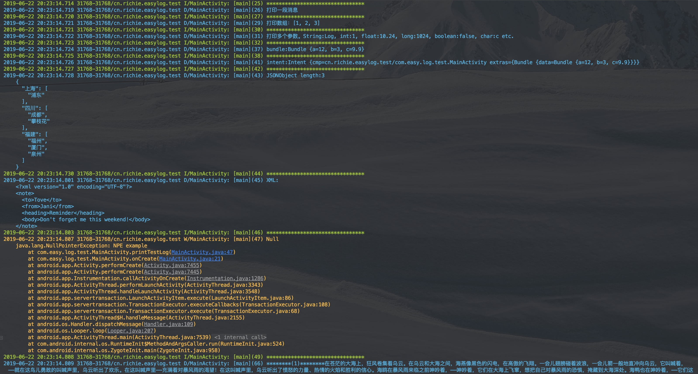

# AndEasyLog

[](https://jitpack.io/#isuperqiang/AndEasyLog)

A concise and elegant Android log library.

**README [中文](README.md)**

### Add dependency：

First of all: Add the following code in build.gradle of root project, means that using JitPack repository.

```groovy
    allprojects {
        repositories {
            ...
            maven { url 'https://jitpack.io' }
        }
    }
```

Secondly: Add dependency in build.gradle of your module, means that compiling log liblary.

```groovy
    dependencies {
        implementation 'com.github.isuperqiang:AndEasyLog:2.0.0'
    }
```

### Features:
1. Support 5 log levels, includes verbose, debug, info, warn and error.
2. Print JSON and XML in pretty format, and print array, intent and bundle directly.
3. Print thread name and line number in log header.
4. Support customize log tag, we use class name generally.
5. Support infinite log length, no 4K char limit.
6. Support output to file, just config output dir.
7. Support specify log level to filter message easily.
8. Import the live-template-settings.jar in project extra dir into your AS, then you could init logger in fast way.

### Usage:
1. **Switch**

> Config logger in Application's onCreate method.

```java
    /*Turn logcat output on, defalut on*/
    /*Turn File output off, defalut off*/
    /*Turn on VERBOSE level*/
        LoggerFactory.init(new LoggerConfig.Builder()
                .context(this)
                .logcatEnabled(true)
                .logFileEnabled(true)
                .logLevel(LoggerConfig.VERBOSE)
                .build());
```
2. **Initialize**

> Instantiate logger in your class with tag.

`private final ILogger logger = LoggerFactory.getLogger("MainActivity");`

Or

`private final ILogger logger = LoggerFactory.getLogger(MainActivity.class);`

3. **Print**

> When printing log with multi params, placeholder `{}` is recommend, avoiding concat string Manually.

* `logger.debug("打印一段消息");`
* `logger.debug("打印多个参数。String:{}, int:{}, long:{}, boolean:{}, char:{} etc.", "AndroidLog", 100, 1000L, false, 'c');`
* `logger.json("{\"上海\":[\"浦东\"],\"四川\":[\"成都\",\"攀枝花\"],\"福建\":[\"福州\",\"厦门\",\"泉州\"]}");`
* `logger.xml("<?xml version=\"1.0\"?><note><to>Tove</to><from>Jani</from><heading>Reminder</heading><body>Don't forget me this weekend!</body></note>");`
* `logger.warn(new NullPointerException("NPE"));`



4. **Log Explanation**：

>  \[Thread name\](Line number) messages

5. **Proguard rules**：

>  No rules

## About me
* [Personal Blog](https://isuperqiang.cn)

## License
<pre>
Copyright 2017 Richie Liu

Licensed under the Apache License, Version 2.0 (the "License");
you may not use this file except in compliance with the License.
You may obtain a copy of the License at

   http://www.apache.org/licenses/LICENSE-2.0

Unless required by applicable law or agreed to in writing, software
distributed under the License is distributed on an "AS IS" BASIS,
WITHOUT WARRANTIES OR CONDITIONS OF ANY KIND, either express or implied.
See the License for the specifAAic language governing permissions and
limitations under the License.
</pre>
